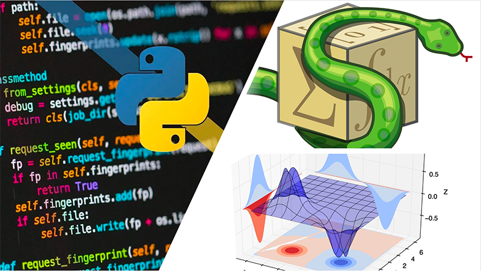

# CURSO-TALLER: Introducción al análisis y visualización de datos en Python

## Fecha
### 31 de agosto - 04 de septiembre de 2020 
## Página el curso
[Página](http://132.247.186.49/)

## Impartido por:
<ul>
  <li> Dr. Ulises Olivares Pinto</li>
  <li> Walter André Rosales Reyes</li>
</ul>

## Temario, materiales y videos

| Día        | Tema           | Contenido  |  Material   | Videos | 
| :------------- |:-------------:|:-----| :-----|:-----: |
| Día 1      | Introducción al lenguaje Python| <ul> <li> Introducción y antecedentes R</li> <li> Entorno de programación</li> <li> Variables y tipos</li> <li>Operadores</li> <li>Instrucciones de control</li> <li>Funciones</li> <li>Librerías</li>  </ul>|  <ol><li> </li> <li></li> <li></li><li></li></ol> | |
| Día 2      |  Almacenamiento de datos | <ul> <li> Listas </li>  <li> Numpy (Arreglos, matrices, subconjuntos, operaciones básicas) </li> <li> Diccionarios </li> <li> Agregar colores y formas a las gráficas </li> <li> Más funciones básicas de estadística descriptiva (regresiones lineales, correlaciones) </li> <li> T Test </li></ul> |  <ol><li></li> <li></li><li></li></ol>| |
| Día 3      | Manipulación de datos | <ul> <li> Importación de datos CSV, TXT </li> <li> Pandas (o	DataFrames, ordenamientos, subconjuntos de filas y columnas, Unión de DataFrames)</li> <li>Estadísticos básicos </li></ul>|  <ol><li></li> <li></li></ol>  | |
| Día 4      | Matemáticas simbólicas y visualización de datos| <ul>  <li> Manipulaciones algebraicas</li> <li> Cálculo (Expansión de series, diferenciación, integración) </li> <li> Resolución de ecuaciones algebraicas</li> <li> Cómo elegir un gráfico adecuado? </li> <li> Matplotlib (o	Gráficos simples y personalización de gráficos)</li></ul>| <ol><li></li> <li></li></ol>  | |
| Día 5      | Python e inteligencia artificial | <ul> <li> Introducción y definiciones</li> <li> Redes neuronales</li> <li> Deep Learning con PyTorch</li></ul> |  <ol><li></li> <li></li></ol>   | |

##### Última modificación 21 de agosto de 2020

